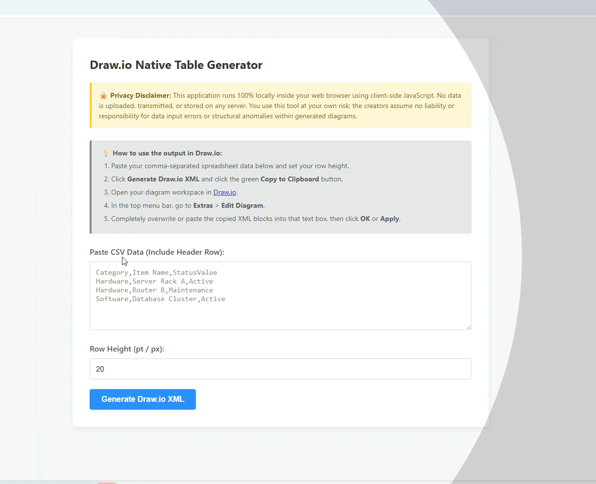

# CSV to Draw.io Table Converter

A fast, lightweight, and privacy-first web application to convert standard comma-separated values (CSV) directly into native, structured table elements for Draw.io (Diagrams.net). 

This tool eliminates the hassle of manually building, sizing, and configuring multi-row table architectures within your diagram workspace by transforming text data into copy-pasteable XML blocks instantly.

---

It's ready to use here: 
👉 **https://adambeltz2.github.io/csv-to-drawio/** Or download a copy of the file to use on your own.

---

## ✨ Features
* **Native Table Elements:** Generates functional, structured Draw.io XML cells rather than independent floating text boxes.
* **Custom Row Heights:** Control the exact row padding (e.g., 20 pt compact grid heights) to cleanly optimize real estate layout spaces.
* **100% Client-Side Parsing:** No servers, backend APIs, or tracking cookies. All calculation math happens locally in your browser.
* **Zero Dependencies:** Built entirely with raw, lightweight semantic HTML5, CSS3, and native JavaScript.

---

## 💡 How to Use

### Step 1: Prepare and Paste Data
1. Copy the table or spreadsheet rows you want to bring into Draw.io.
2. Form it into standard CSV syntax (include a header row as your first line).
3. Paste the contents into the web app's main input area.

### Step 2: Configure Layout
1. Set your preferred **Row Height** in points (defaults to `20` for a clean, tight fit).
2. Click the **Generate Draw.io XML** button.

### Step 3: Insert Into Draw.io
1. Click the green **Copy to Clipboard** button on the web app.
2. Open your target diagram tab on [Draw.io](https://app.diagrams.net/).
3. In the top menu bar, navigate to **Extras** > **Edit Diagram**.
4. Clear out or overwrite the text area completely by pasting your copied XML string.
5. Click **Apply** or **OK**. 

*Your fully populated, pixel-perfect table will appear directly on your canvas workspace!*

---

## 🔒 Privacy & Data Security
Data privacy is built into the fundamental structure of this utility:
* **No Server Transfers:** Your data never leaves your computer. The application processes inputs inside the browser sandbox locally via the native JavaScript layer.
* **No Database Storage:** No analytical logs, data frames, or data fields are stored, tracked, or mirrored.

---

## 🔧 Deployment & Local Usage
Since this tool consists of a single self-contained document file (`index.html`), it requires no deployment pipelines or complex hosting infrastructures.

### Running Locally
1. Download or clone this repository.
2. Double-click the `index.html` file to open it locally inside any web browser.

### Hosting via GitHub Pages
1. Go to your repository's **Settings** tab.
2. Click **Pages** along the left sidebar menus.
3. Change the **Source** branch selector from `None` to **`main`** (or `master`) and hit **Save**.
4. Your free web instance link will go live in less than 60 seconds.

---

## ⚖️ Disclaimer
*This application runs 100% locally inside your web browser using client-side JavaScript. No data is uploaded, transmitted, or stored on any server. You use this tool at your own risk; the creators assume no liability or responsibility for data input formatting mistakes or layout anomalies within generated diagram workflows.*
